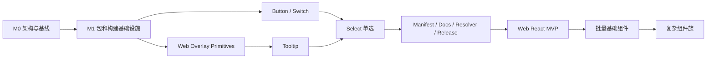

# Aurora 多产品组件库项目计划

## 1. 计划信息

| 项目 | 内容 |
| --- | --- |
| 计划状态 | M5 Web 双 renderer MVP 已验收，M6-B14 Popconfirm 已完成 |
| 计划版本 | 0.1 |
| 规划基线 | 87 个 Vue 组件，现有 Vue 测试、文档和发布流程继续作为回归基线 |
| 首个目标 | 形成可发布的 Web React MVP，并保持 Web Vue 兼容 |
| 首批试点 | Button、Switch、Tooltip、Select 单选模式 |
| 命名决策 | 公共底座使用 `@aurora/core` 和 `@aurora/theme`；Web 产品使用 Horizon；移动端产品使用 Skyline |
| 规划单位 | 工程日和两周迭代；工程日表示一名工程师的有效开发时间 |
| 计划调整点 | 每个里程碑结束时根据实测复杂度、共享比例和回归结果重新估算 |

本计划是《[Aurora 多产品组件库整改指南](./multi-platform-refactor.md)》的执行层。整改指南定义长期架构与边界，本计划定义先做什么、如何验收、何时允许进入下一阶段。

## 2. 规划假设

当前排期按以下资源模型制定：

- 2 名全职前端工程师；
- 1 名测试或质量负责人提供阶段性支持；
- 设计和无障碍评审按里程碑参与；
- 现有 Vue 组件仍可能接受必要维护，但暂停无明确收益的大规模内部重构；
- 一个迭代为两周，计划以工程量为主，日历时间随实际投入人数调整；
- Skyline Mobile 包只预留边界，本轮不实现移动端 renderer。

如果只有 1 名工程师，保持任务顺序不变，延长日历周期；不得通过跳过测试、文档、兼容层或基础设施缩短周期。

## 3. 项目目标

### 3.1 MVP 目标

首个 Web React MVP 必须包含：

- `@aurora/core`、`@aurora/theme`、`@aurora/horizon-web-core` 基础包；
- `@aurora/horizon-web-vue` 与 `@aurora/horizon-web-react` renderer 基础设施；
- Button、Switch、Tooltip、Select 单选模式的 Vue/React 双实现；
- 公共 Token、locale key、状态协议和行为测试向量；
- React ESM、类型声明、样式和 SSR 安全入口；
- Vue/React 双框架文档示例；
- 能够识别新包名的构建、resolver、版本和发布流程；
- `@aurora/horizon-web` 兼容策略的可运行验证版本。

### 3.2 成功指标

MVP 达到以下指标才允许进入批量组件迁移：

1. Vue 现有公开 API 和试点组件行为无主动 breaking change；
2. Core 产物不存在 Vue、React、VNode、ReactNode 和框架 router 依赖；
3. Vue 与 React 对共享行为使用同一套 test vectors；
4. 试点组件的 keyboard、focus、disabled、loading、controlled state 和事件语义一致；
5. 文档构建、Core/Vue/React 类型检查、单元测试、浏览器测试和 SSR smoke test 通过；
6. 按需导入不会重复打包 renderer 或意外丢失 CSS；
7. 试点结果证明架构能覆盖展示、表单、浮层和复杂选择组件；
8. 发现的差异均进入 manifest、兼容说明或明确的技术债清单，不以隐式行为存在。

### 3.3 本轮非目标

- 在 M0–M5 MVP 验收前一次迁移全部 87 个组件；M6/M7 按依赖批次继续完成全量拆分；
- 立即删除 `@aurora/horizon-web`；
- 实现 `skyline-mobile-vue/react`；
- 强制 Vue 与 React 使用完全相同的 props 名称；
- 创建自定义 VDOM 或通用模板 DSL；
- 在架构未通过 Select 试点前大批量复制组件代码；
- 同时替换所有第三方依赖或重写主题系统。

## 4. 项目工作流

项目拆为九条工作流：

| 工作流 | 代码 | 目标 |
| --- | --- | --- |
| 治理与基线 | GOV | 冻结边界、记录现状、控制 breaking change |
| 包与构建 | PKG | 建立 core、platform core 和双 renderer 构建链路 |
| 公共工具 | UTIL | 将纯工具与 Vue 工具分离 |
| 主题与图标 | DS | 共享 Token、CSS 和图标数据 |
| 行为内核 | CORE | 建立 reducer/controller/adapter 模型 |
| Vue 兼容 | VUE | 让现有 Vue 实现消费公共能力且行为不回退 |
| React renderer | REACT | 提供 React 原生 API 和运行时实现 |
| 文档与生成器 | DOC | 双框架文档、manifest、API Generator 和 resolver |
| 质量与发布 | QA | 契约测试、SSR、bundle、版本、兼容包和发布演练 |

## 5. 里程碑总览

| 里程碑 | 目标 | 初始工程量 | 退出结果 |
| --- | --- | ---: | --- |
| M0 架构冻结 | 建立边界、基线和执行规则 | 8–12 工程日 | 团队可以在不争论基础命名和依赖方向的情况下开发 |
| M1 基础设施 | 建立包、构建、工具、主题和 React 测试骨架 | 18–28 工程日 | 空包可构建，Core 边界受 CI 保护 |
| M2 基础试点 | 完成 Button、Switch | 18–26 工程日 | 受控状态、Form、样式和基础 API 模型成立 |
| M3 浮层试点 | 完成 Web overlay primitives 和 Tooltip | 16–24 工程日 | Portal/Teleport、焦点、定位和 SSR 模型成立 |
| M4 复杂试点 | 完成 Select 单选模式 | 28–42 工程日 | 复杂 controller、Option、Form、键盘和浮层组合成立 |
| M5 工具闭环 | 打通 manifest、文档、resolver、版本和发布演练 | 18–26 工程日 | Web React MVP 可消费、可文档化、可发布 |
| M6 批量基础组件 | 迁移展示、布局、基础表单和浮层组件 | 60–90 工程日 | React 可支撑普通业务页面 |
| M7 复杂组件族 | 按依赖链迁移 Picker、Tree、Table、Upload 等 | 按组件重新估算 | React 组件覆盖达到产品目标 |

M0 至 M5 是首个 MVP 的强制范围，初始总工程量为 106–158 工程日。该区间包含开发、评审、测试和文档，不包含业务接入方的迁移时间。M2、M3 的部分工作可以并行，但 M4 必须建立在前述基础设施已经稳定的前提下。

## 6. 关键路径



关键路径上的任务不得通过临时复制 Vue 实现绕过，否则会把架构风险推迟到后续复杂组件。

## 7. 迭代计划

### 迭代 0：架构冻结与基线

目标：完成 M0，建立后续开发可以共同遵循的事实基线。

计划任务：

| ID | 任务 | 交付物 | 验收 |
| --- | --- | --- | --- |
| GOV-001 | 创建架构决策记录 | 包命名、依赖图、兼容周期 ADR | 与整改指南一致，无未决命名冲突 |
| GOV-002 | 生成组件与能力清单 | 87 个组件的复杂度、依赖和迁移批次表 | 每个组件有 owner 类型、批次和关键依赖 |
| GOV-003 | 记录 Vue API 基线 | 试点组件 props/emits/slots/exposes 快照 | 基线可由 CI 重复生成和比较 |
| QA-001 | 记录质量基线 | 单测、浏览器测试、文档构建、bundle 和 SSR 现状 | 结果写入项目状态记录 |
| GOV-004 | 定义 breaking change 流程 | 变更分类、评审人、弃用周期 | 新 API 变更有明确审批路径 |

退出门槛：

- ADR 合并；
- 组件清单和基线报告可重复生成；
- 试点范围、MVP 范围和非目标明确；
- 不存在会改变包命名或依赖方向的未决决策。

### 迭代 1：包骨架与边界检查

目标：创建不含组件实现的包结构，打通最小构建和测试。

计划任务：

| ID | 任务 | 交付物 | 验收 |
| --- | --- | --- | --- |
| PKG-001 | 创建 `core` | package、tsconfig、Vite/Vitest、exports | build/typecheck/test 通过，无产品、平台和 renderer 依赖 |
| PKG-002 | 创建 `horizon-web-core` | DOM 能力包骨架 | SSR import 不访问浏览器全局 |
| PKG-003 | 创建 `theme` | 统一 Token 源及 Web/Native 输出骨架 | Web Vue/React 消费同一 CSS，Skyline 可消费同源 TS/JSON Token |
| PKG-004 | 创建 `horizon-web-react` | React 19、类型、测试、SSR 骨架 | ESM、类型、renderToString smoke test 通过 |
| PKG-005 | 规划 `horizon-web-vue` 迁移 | 目录迁移清单和兼容包原型 | 明确所有写死路径，不立即大规模移动源码 |
| QA-002 | 添加依赖边界检查 | CI 脚本和失败示例测试 | Core 导入 Vue/React 时 CI 必须失败 |

退出门槛：所有新包独立 build/typecheck/test 通过，根工作区脚本可以发现它们，现有 Vue 测试不受影响。

#### M1 实施记录（2026-08-10）

| 任务 | 状态 | 实施结果 |
| --- | --- | --- |
| PKG-001 | Done | 新建 `@aurora/core`，承载纯类型、数组/对象/数值工具、通用守卫和 EventEmitter |
| PKG-002 | Done | 新建 `@aurora/horizon-web-core`，首批抽出 SSR 安全的 browser detection 与 body scroll lock |
| PKG-003 | Done | 新建统一的 `@aurora/theme`，提供 namespace、class contract、Token 展平与 CSS variable 输出骨架 |
| PKG-004 | Done | 新建 `@aurora/horizon-web-react`，完成 Provider、context/hook、React 18/19 peer range 与 SSR smoke test |
| PKG-005 | Done | Vue 实现已迁移到 `packages/horizon-web-vue` 并更名为 `@aurora/horizon-web-vue`；旧 `@aurora/horizon-web` 兼容转发包仍按 PKG-008 单独实现 |
| UTIL-002 | Done | `@aurora/utils` 通过兼容转发消费 `core/theme/web-core`，现有 Vue 导入路径保持有效 |
| QA-002 | Done | 新增 foundation package boundary scan，并接入根测试命令和 Pages 构建依赖顺序 |

本期不包含 Button、Switch 等 renderer 组件实现，也不提前创建 Skyline renderer。M2 从 Button/Switch 的状态协议和双 renderer 试点开始。

### 迭代 2：公共工具、主题与 React 基础运行时

目标：清理会污染 Core 和 React 的基础依赖。

计划任务：

| ID | 任务 | 交付物 | 验收 |
| --- | --- | --- | --- |
| UTIL-001 | 分类 `@aurora/utils` | pure、DOM、Vue 三类导出清单 | 每个现有导出有目标归属和兼容策略 |
| UTIL-002 | 抽出纯工具入口 | namespace、class helper、类型判断等 | 不依赖 Vue 和 `@vueuse`，原 Vue 导入仍兼容 |
| DS-001 | 抽出主题源数据 | Token、CSS variables、BEM 规则 | 两端能生成相同核心 class 和变量 |
| DS-002 | 设计图标分层 | icon-core、Vue renderer、React renderer 原型 | 同一图标名称在两端可渲染且按需引入 |
| REACT-001 | 建立 ConfigProvider | namespace、size、locale、theme、navigation 能力接口 | Provider 嵌套和多实例测试通过 |
| QA-003 | 建立共享 test vectors 工具 | 跨 renderer 的行为用例格式 | Vue/React 测试可消费同一数据集 |

退出门槛：React 包不再需要从 Vue 污染的 `@aurora/utils` 根入口获取公共能力。

### 迭代 3：Button 与 Switch 试点

目标：验证基础组件、受控状态和 Form 协议。

Button 任务：

| ID | 任务 | 交付物 | 验收 |
| --- | --- | --- | --- |
| CORE-BTN-001 | 抽取 Button 语义 | defaults、状态计算、异步 action、导航协议 | 纯单测覆盖 click 优先级和 debounce |
| VUE-BTN-001 | Vue Button 消费公共逻辑 | 保持现有 props/emits/slots | 原测试和新增回归测试通过 |
| REACT-BTN-001 | React Button | React props、children、ref、navigation adapter | controlled/loading/disabled/keyboard 通过 |
| DS-BTN-001 | 共享 Button 样式 | 公共 class 与 CSS | 两端视觉和状态 class 契约通过 |

Switch 任务：

| ID | 任务 | 交付物 | 验收 |
| --- | --- | --- | --- |
| CORE-SW-001 | 抽取 Switch state model | value、pending、disabled、change reason | controlled/uncontrolled test vectors 通过 |
| VUE-SW-001 | Vue Switch 适配 | Vue modelValue 与 Form trigger | 原行为不回退 |
| REACT-SW-001 | React Switch | value/defaultValue/onChange/ref | StrictMode、Form 和键盘测试通过 |
| DOC-PILOT-001 | 双框架基础示例 | Button/Switch Vue/React 示例 | 中英文页面可构建、示例可交互 |

退出门槛：公共状态模型能够同时支持 Vue modelValue 与 React value/defaultValue，不产生回写循环。

#### M2 实施记录（2026-08-10）

| 任务 | 状态 | 实施结果 |
| --- | --- | --- |
| CORE-BTN-001 | Done | 在 `@aurora/core` 建立 Button 状态计算、action 优先级和异步防重入协议，并提供共享测试向量 |
| VUE-BTN-001 | Done | Vue Button 通过 composable 消费公共协议，保留既有 props、emits、slot、路由和异步行为 |
| REACT-BTN-001 | Done | React Button 提供原生 `children`、ref、原生 button/link 属性和 Provider navigation adapter |
| DS-BTN-001 | Done | Button Sass 源迁入 `@aurora/theme`，Vue 使用兼容代理，React 构建输出同源 CSS |
| CORE-SW-001 | Done | 在 `@aurora/core` 建立受控值、交互状态、同步/异步 beforeChange 和结果原因协议 |
| VUE-SW-001 | Done | Vue Switch 通过 composable 消费公共协议，保持 Form trigger 与同步事件时序，并防止异步陈旧结果回写 |
| REACT-SW-001 | Done | React Switch 支持受控/非受控状态、原生 checkbox/Form、ref、键盘与异步守卫 |
| DOC-PILOT-001 | Done | Button、Switch 中英文组件页分别补充 React 原生用法；组件文档不包含框架 API 映射或对照表 |
| QA-PILOT-001 | Done | Core、Vue、React 消费共享 test vectors；补充组件、hook、浏览器样式和 SSR/build 回归验证 |

M2 的公共抽取只包含与渲染框架无关的状态和行为协议。组件结构、事件对象、路由接入、Form 接入与生命周期仍由各 renderer 负责；共享主题作为唯一 Sass 源，Vue 旧路径在兼容期内继续可用。

### 迭代 4：Web Overlay Primitives 与 Tooltip

目标：验证 Web 平台能力和跨 renderer 浮层模型。

计划任务：

| ID | 任务 | 交付物 | 验收 |
| --- | --- | --- | --- |
| WEB-OV-001 | Positioner | 基于 DOM 的定位、offset、flip、shift | Vue/React 共用计算，窄视口测试通过 |
| WEB-OV-002 | Dismissable Layer | outside pointer、Escape、层级协调 | 嵌套浮层不会误关闭 |
| WEB-OV-003 | Focus 管理 | focus trap、restore、roving tabindex primitives | keyboard 和 assistive technology 路径通过 |
| WEB-OV-004 | Scroll 与 Portal 容器 | scroll lock、container 协议 | 多容器、SSR 和 cleanup 测试通过 |
| CORE-TT-001 | Tooltip 状态协议 | open reason、delay、controlled state | hover/focus/click test vectors 通过 |
| VUE-TT-001 | Vue Tooltip 适配 | Teleport、slots、existing API | 原测试通过 |
| REACT-TT-001 | React Tooltip | Portal、render content、open API | focus、hover、Escape、StrictMode 通过 |

退出门槛：Vue/React 不共享渲染代码，但共享定位、dismiss、焦点协议和行为测试。

#### M3 实施记录（2026-08-11）

| 任务 | 状态 | 实施结果 |
| --- | --- | --- |
| WEB-OV-001 | Done | 在 `@aurora/horizon-web-core/src/components/Tooltip` 提供 SSR 安全的 Positioner，支持 12 个位置、distance、skidding、flip、fallback、shift、箭头和 reference hidden 检测 |
| WEB-OV-002 | Done | 建立只响应顶层浮层的 Dismissable Layer，覆盖 Escape、outside pointer、嵌套层和 trigger branch |
| WEB-OV-003 | Done | 建立 Focus Scope、焦点恢复、Tab 循环和 roving tabindex primitives，并在真实 Chromium 中验证 |
| WEB-OV-004 | Done | 复用计数式 body scroll lock，新增 SSR 安全的 Portal container 解析和浮层 cleanup 协议 |
| CORE-TT-001 | Done | 在 `@aurora/core` 建立可注入 scheduler 的 Tooltip 延迟状态协议、open reason 和共享测试向量 |
| VUE-TT-001 | Done | Vue Tooltip 回接共享 controller 与 Positioner，保留既有 props、slots、exposes、复制和 Teleport 行为 |
| REACT-TT-001 | Done | React Tooltip 提供原生 children、Portal、受控/非受控状态、ref、ARIA、hover/focus/click/contextmenu、Escape 与外部关闭 |
| DS-TT-001 | Done | Tooltip Sass 和变量迁入 `@aurora/theme`，Vue 使用兼容代理，React 构建输出同源 CSS |
| DOC-TT-001 | Done | React Tooltip 中英文页面、独立 TSX 示例和侧边栏入口完成，renderer 隔离检查通过 |

从 M3 起，`core`、`horizon-web-core`、`horizon-web-vue` 和 `horizon-web-react` 的组件能力统一放入大小写一致的 `src/components/<Component>` 目录；通用工具进入 `src/utils`，不再将组件文件平铺在公共包的 `src` 根目录。

### 迭代 5：Select Core 与 Vue 回接

目标：先把 Select 的值、Option、过滤、选择和状态转换变成可独立测试的能力。

计划任务：

| ID | 任务 | 交付物 | 验收 |
| --- | --- | --- | --- |
| CORE-SEL-001 | 公共 Select 类型 | value、option、change reason、state、action | 不包含 VNode/ReactNode/Ref |
| CORE-SEL-002 | 值归一化与比较 | value format、equal、empty、initial 规则 | 现有边界行为被测试向量覆盖 |
| CORE-SEL-003 | Option collection | 注册、过滤、disabled、active、selected | 动态 Option 和重复值策略明确 |
| CORE-SEL-004 | Select controller | controlled state、panel、input、highlight | 多实例、destroy、竞态测试通过 |
| VUE-SEL-001 | Vue Select 回接 Core | watch/emit/inject 只留在 adapter | Vue 单选现有测试通过 |
| QA-SEL-001 | Select 行为基线对比 | 事件顺序和 payload 对照 | 无未记录行为变化 |

退出门槛：Vue Select 单选模式已消费 Core，Core 测试不需要挂载 Vue。

### 迭代 6：React Select 单选模式

目标：完成 React Select 并验证复杂组件架构。

计划任务：

| ID | 任务 | 交付物 | 验收 |
| --- | --- | --- | --- |
| REACT-SEL-001 | React Select adapter | value/defaultValue/onChange/open/ref | controlled/uncontrolled 与 Vue 语义对齐 |
| REACT-SEL-002 | React Option/OptionGroup | children 与 data options 两种输入 | 动态增删和 disabled 测试通过 |
| REACT-SEL-003 | React panel/renderers | option、empty、header、footer render API | 自定义渲染不进入 Core |
| REACT-SEL-004 | Form 与 locale 集成 | Provider、error、change trigger、字典 | 多语言与 Form 测试通过 |
| QA-SEL-002 | 浏览器契约测试 | keyboard、focus、ARIA、popup、narrow viewport | Vue/React 关键流程和视觉验收通过 |
| DOC-SEL-001 | Select 分框架文档 | React 原生页面与示例、Vue 独立页面 | 中英文文档构建通过且页面不混写 renderer |

退出门槛：Select 单选模式证明 controller、overlay、Form、locale、render API 和共享 CSS 可以形成闭环。

#### M4 实施记录

| 能力 | 状态 | 实施结果 |
| --- | --- | --- |
| CORE-SEL-001–004 | Done | `@aurora/core/src/components/Select` 提供公共类型、值归一化、格式化值协议、深比较、Option collection、过滤、键盘导航和受控同步 controller |
| WEB-SEL-001 | Done | `@aurora/horizon-web-core/src/components/Select` 提供 combobox/listbox/option ARIA、DOM 键盘 adapter 与 active option 滚动 |
| VUE-SEL-001 | Done | Vue Select 的模型归一化和 value-format 协议回接 Core，保持既有组件 API 与测试基线 |
| REACT-SEL-001–004 | Done | React Select 支持受控/非受控值与面板、data/children Option、OptionGroup、过滤、Portal、浮层定位、Provider 字典、表单字段和 render API |
| DS-SEL-001 | Done | Select 样式与变量迁入 `@aurora/theme`；Vue 使用兼容代理，React 复用相同视觉变量与 Option 样式 |
| DOC-SEL-001 | Done | React Select 中英文页面、独立 TSX 示例和侧边栏入口完成，不在组件文档中描述框架映射关系 |

### 迭代 7：生成器、resolver、发布和 MVP 验收

目标：让试点成果成为真实可消费的组件库，而不仅是仓库内原型。

计划任务：

| ID | 任务 | 交付物 | 验收 |
| --- | --- | --- | --- |
| DOC-001 | 组件公共 manifest | 公共描述、语义、a11y、测试元数据 | 试点组件不依赖源码猜测生成公共信息 |
| DOC-002 | Vue/React manifest adapter | props/events/slots/ref 映射 | API 表可分别生成 |
| DOC-003 | 双框架文档运行时 | Vue/React 示例 tab 和编译环境 | 示例独立构建且错误可定位 |
| PKG-006 | resolver 平台化 | Vue/React package 和 style 路径解析 | 按需导入 smoke project 通过 |
| PKG-007 | 版本与发布脚本改造 | 新包版本、依赖替换、发布顺序 | dry run 输出正确，不修改无关包 |
| PKG-008 | 兼容包验证 | `@aurora/horizon-web` 转发原型 | 默认、具名、样式入口兼容 |
| QA-004 | 消费端矩阵 | Vite Vue、Vite React、SSR smoke projects | install/build/render/tree-shaking 通过 |
| QA-005 | MVP 验收报告 | 指标、差异、风险和下一阶段估算 | 所有 M0–M5 退出门槛有证据 |

退出门槛：Web React MVP 可构建、按需引入、文档化和发布演练；MVP 验收报告批准后才进入批量迁移。

### M5 实施记录

| 能力 | 状态 | 实施结果 |
| --- | --- | --- |
| DOC-001 | Done | 四个试点组件在 Core 同名目录提供公共 manifest、API contract、无障碍要求和测试向量 |
| DOC-002 | Done | 公共 adapter 支持 renderer 字段重命名、删减和扩展，文档准备阶段分别生成 Vue/React contract JSON |
| DOC-003 | Done | Vue/React 页面、侧边栏、示例目录、编译器和错误边界保持独立 |
| PKG-006 | Done | resolver 显式支持 Vue/React 包名与样式入口，12 个 resolver 测试通过 |
| PKG-007 | Done | 版本表和发布顺序覆盖 Core、Theme、Web Core、双 renderer 与兼容包；dry-run 不修改包文件 |
| PKG-008 | Done | `@aurora/horizon-web` 默认、具名、CommonJS 和样式转发原型通过 |
| QA-004 | Done | Vite Vue、Vite React、Vue SSR、React SSR 和 React tree-shaking smoke 通过 |
| QA-005 | Done | [Web Vue/React MVP 验收报告](./mvp-acceptance-report.md)记录指标、风险和 M6 准入结论 |

## 8. M6 批量迁移顺序

MVP 后按依赖和风险分批推进。

### 批次 A：展示与布局

```text
Badge Avatar Card Divider Space Typography Progress Skeleton
Alert Empty Result Statistic Count
```

目标：快速形成 React 页面展示能力，并继续验证共享样式。

#### M6-A1 实施记录（2026-08-11）

| 任务 | 状态 | 实施结果 |
| --- | --- | --- |
| CORE-API-002 | Done | 建立类型化组件 API 契约，统一承载公共 props、默认值、校验器、事件参数、渲染区域和命令；renderer 只保留框架适配 |
| CORE-AVATAR-001 | Done | Avatar 公共尺寸、fit、类型、默认值、校验器和文字缩写逻辑迁入 `@aurora/core` |
| CORE-BADGE-001 | Done | Badge 公共类型、定位、默认值、校验器和数量封顶逻辑迁入 `@aurora/core` |
| CORE-DIVIDER-001 | Done | Divider 公共方向、线型、标题位置、兼容别名和默认值迁入 `@aurora/core` |
| CORE-SPACE-001 | Done | Space 公共方向、尺寸、对齐、默认值、校验器和默认对齐逻辑迁入 `@aurora/core` |
| VUE-A1-001 | Done | 四个 Vue 组件直接消费公共类型、默认值、校验器和纯逻辑，保留原有 props、emits、slots 与行为 |
| REACT-A1-001 | Done | 完成 Avatar、Badge、Divider、Space 和 SpaceItem 的 React 原生实现、ref、ARIA 与 Fragment 行为 |
| DS-A1-001 | Done | 四组 Sass 和变量迁入 `@aurora/theme`，Vue 使用代理入口，React 构建输出同源 CSS |
| DOC-A1-001 | Done | 四个组件的中英文 React 页面、TSX 示例和独立侧边栏入口完成，renderer 隔离检查通过 |
| QA-A1-001 | Done | 8 组 Vue/React 契约生成通过；Core 42、React Chromium 35、Vue 全量 2296 项通过，Vue 覆盖率四项均超过 95% |

下一批 M6-A2 迁移 `Card Typography Progress Skeleton Alert Empty Result Statistic Count`。

#### M6-A2 第一批实施记录（2026-08-11）

| 任务 | 状态 | 交付 |
| --- | --- | --- |
| CORE-A2-001 | Done | Card、Typography、Progress、Skeleton 公共 props、默认值、校验器、事件元组、内容区域、命令和纯算法迁入 `@aurora/core` |
| VUE-A2-001 | Done | 四个 Vue 组件消费公共契约和纯算法，保留现有 props、emits、slots、exposes 与组件行为 |
| REACT-A2-001 | Done | 完成 Card、Typography、Progress、Skeleton 与 SkeletonItem 的 React 原生实现、ref、ARIA、受控与非受控行为 |
| DS-A2-001 | Done | 四组 Sass 和变量迁入 `@aurora/theme`，Vue 通过代理入口加载，React 构建使用同源样式 |
| DOC-A2-001 | Done | 四个组件的中英文 React 页面、独立 TSX 示例和 React 侧边栏入口完成 |
| QA-A2-001 | Done | 12 组 Vue/React 契约生成；Core 50、React Chromium 45、Vue 全量 2296 项通过，覆盖率四项均超过 95%，包构建、文档和 Vue/React/SSR 消费工程通过 |

#### M6-A2 第二批实施记录（2026-08-11）

| 任务 | 状态 | 交付 |
| --- | --- | --- |
| CORE-A2-002 | Done | Alert、Empty、Result、Statistic、Count 的公共 props、默认值、校验器、事件元组、渲染区域、命令和纯算法迁入 `@aurora/core` |
| VUE-A2-002 | Done | 五个 Vue 组件消费公共契约与算法，仅保留 Vue props、emits、slots 和渲染适配；Count 定时器支持重调度与卸载清理 |
| REACT-A2-002 | Done | 五个 React 原生组件、回调、children/ref、ARIA 和浏览器行为实现 |
| DS-A2-002 | Done | 五组 Sass、变量和 Empty/Result 公共 SVG 资产迁入 `@aurora/theme`，资源子路径自带 TypeScript 声明 |
| DOC-A2-002 | Done | 五个组件的中英文 React 页面、独立 TSX 示例和侧边栏入口 |
| QA-A2-002 | Done | 17 组 Vue/React 契约生成；Core 59、React Chromium 56、Vue 全量测试通过，覆盖率为 98.06% / 95.31% / 97.84% / 98.30%，包构建、文档和 Vue/React/SSR 消费工程通过 |

### 批次 B：基础表单与导航

```text
Input Checkbox Radio Segmented Slider Rate
Tabs Collapse Pagination Breadcrumb Steps Timeline Link
```

依赖：Form 基础协议、controlled/uncontrolled 工具、keyboard primitives。

#### M6-B1 第一批实施记录（2026-08-11）

| 任务 | 状态 | 交付 |
| --- | --- | --- |
| CORE-B1-001 | Done | Rate、Segmented 的公共 props、默认值、枚举、校验器、事件载荷、渲染区域、命令和键盘纯算法迁入 `@aurora/core` |
| VUE-B1-001 | Done | 两个 Vue 组件通过适配器消费公共契约，将 events、regions、commands 落为 emits、slots、exposes，并保留 Vue 原生类型和既有行为 |
| REACT-B1-001 | Done | 完成 Rate、Segmented 的 React 原生受控/非受控实现、callbacks、render regions、ref commands、ARIA 和键盘交互 |
| DS-B1-001 | Done | 两组 Sass 与变量迁入 `@aurora/theme`，Vue 使用包导出代理，React 构建输出同源样式 |
| DOC-B1-001 | Done | 两个组件的中英文 React 页面、独立 TSX 示例和表单组件侧边栏入口完成，renderer 隔离检查通过 |
| QA-B1-001 | Done | 19 组 Vue/React 契约生成；Core 65、React Chromium 64、Vue 全量测试通过，覆盖率为 98.04% / 95.29% / 97.81% / 98.30%，四个包构建、文档和 Vue/React/SSR 消费工程通过 |

#### M6-B2 第二批实施记录（2026-08-11）

| 任务 | 状态 | 交付 |
| --- | --- | --- |
| CORE-API-003 | Done | 增加框架无关的 API 形状适配、renderer prop 完整性约束以及 event validator/handler 推导；公共 props/events/regions/commands 成为两端唯一语义来源 |
| CORE-B2-001 | Done | Checkbox、Radio 及其 Group 的公共 props、默认值、校验器、事件载荷、渲染区域、命令和值选择算法迁入 `@aurora/core`；Choice 类型由两组件共享 |
| WEB-B2-001 | Done | 在同名 Web Core 目录提供原生 checkbox indeterminate 同步与 radio input focus primitives，并覆盖 Node/Chromium 测试 |
| VUE-B2-001 | Done | Vue props/emits/slots/exposes 通过类型化适配消费公共契约，保留 modelValue、Vue runtime props、可变数组兼容和原生事件；补齐 scoped slot、focus 与 indeterminate 行为 |
| REACT-B2-001 | Done | 完成 Checkbox、CheckboxButton、CheckboxGroup、Radio、RadioButton、RadioGroup 的受控/非受控实现；callbacks、render regions 和 ref commands 从公共契约推导并保留 React 原生扩展 |
| DS-B2-001 | Done | Checkbox、Radio Sass 与变量迁入 `@aurora/theme`，Vue 使用包导出代理，React 使用同源样式和 renderer 专属 indicator 规则 |
| DOC-B2-001 | Done | Checkbox、Radio 的中英文 React 页面、独立 TSX 示例和表单侧边栏入口完成；组件文档保持 renderer 原生表达 |
| QA-B2-001 | Done | 21 组 Vue/React 契约生成；Core 72、Web Core Node 7/Chromium 9、React Chromium 73、Vue 2297 项通过且 1 项预期失败，覆盖率为 98.04% / 95.27% / 97.80% / 98.30%，包构建、文档和 Vue/React/SSR 消费工程通过 |

#### M6-B3 第三批实施记录（2026-08-11）

| 任务 | 状态 | 交付 |
| --- | --- | --- |
| CORE-B3-001 | Done | Slider 的公共 props、默认值、校验器、事件载荷、命令以及边界、步长、范围、进度、刻度、指针和键盘算法迁入 `@aurora/core` |
| WEB-B3-001 | Done | 在同名 Web Core 目录提供轨道几何、游标聚焦与 pointer capture primitives，并覆盖 Node/Chromium 测试 |
| VUE-B3-001 | Done | Vue props/emits/exposes 通过类型化适配消费公共契约，既有 modelValue、InputNumber 扩展和可变数组兼容保持不变；渲染逻辑复用 Core/Web Core |
| REACT-B3-001 | Done | 完成 Slider 单值/范围、受控/非受控、轨道点击、指针拖动、键盘、数字输入、tooltip、ARIA 和 ref focus 命令 |
| DS-B3-001 | Done | Slider Sass 与变量迁入 `@aurora/theme`，Vue 使用包导出代理，React 使用同源样式并补齐原生输入和 tooltip 规则 |
| DOC-B3-001 | Done | Slider 中英文 React 页面、独立 TSX 示例和表单侧边栏入口完成；22 组 Vue/React 契约生成且 renderer 隔离检查通过 |
| QA-B3-001 | Done | Core 77、Web Core Node 7/Chromium 11、React Chromium 77、Vue 2297 项通过且 1 项预期失败，覆盖率为 98.00% / 95.23% / 97.76% / 98.27%，五个包构建、文档和 Vue/React/SSR 消费工程通过 |

#### M6-B4 第四批实施记录（2026-08-11）

| 任务 | 状态 | 交付 |
| --- | --- | --- |
| CORE-B4-001 | Done | Input 的公共 props、默认值、枚举、校验器、事件载荷、渲染区域、命令以及类型归一、超限和 change 判定算法迁入 `@aurora/core` |
| WEB-B4-001 | Done | 在同名 Web Core 目录提供 textarea 自适应高度计算与 input focus/blur/select primitives，并覆盖 Node/Chromium 测试 |
| VUE-B4-001 | Done | Vue props/emits/slots/exposes 通过类型化适配消费公共契约，仅保留 modelValue、Vue runtime props、图标与原生属性等 renderer 差异；输入、布局与命令复用 Core/Web Core |
| REACT-B4-001 | Done | 完成 Input 单行、textarea、密码、受控/非受控、IME、清空、长度统计、自适应高度、四个渲染区域与 ref 命令 |
| DS-B4-001 | Done | Input Sass 与变量迁入 `@aurora/theme`，Vue 使用包导出代理，React 使用同源样式并补齐清空和密码按钮规则 |
| DOC-B4-001 | Done | Input 中英文 React 页面、独立 TSX 示例和表单侧边栏入口完成；23 组 Vue/React 契约生成且 renderer 隔离检查通过 |
| QA-B4-001 | Done | Core 80、Web Core Node 7/Chromium 13、React Chromium 81、Vue 2297 项通过且 1 项预期失败，覆盖率为 98.00% / 95.25% / 97.78% / 98.27%，五个包构建、文档和 Vue/React/SSR 消费工程通过 |

#### M6-B5 第五批实施记录（2026-08-11）

| 任务 | 状态 | 交付 |
| --- | --- | --- |
| CORE-API-004 | Done | 修复公共 API 形状适配器在重命名时丢失 optional/readonly 修饰符的问题，新增类型回归测试与 navigation manifest 分类 |
| CORE-B5-001 | Done | Link 的公共 props、默认值、枚举、校验器、点击事件、渲染区域、交互优先级、action 语义与 loading 尺寸迁入 `@aurora/core` |
| WEB-B5-001 | Done | 在同名 Web Core 目录提供滚动容器解析、锚点坐标计算、平滑滚动与 hash 更新 primitives，并覆盖 Chromium 测试 |
| VUE-B5-001 | Done | Vue props/emits/slots 通过类型化适配消费公共契约，保留 Application 尺寸、Vue Router、图标和 locale 能力；锚点与 disabled/loading 交互复用 Core/Web Core |
| REACT-B5-001 | Done | 完成 Link 原生 href、action、Provider 路由导航与地址解析、锚点滚动、键盘、加载、禁用、内容区域与原生 ref；Button/Link 复用 renderer `_shared` LoadingIcon |
| DS-B5-001 | Done | Link Sass 与变量迁入 `@aurora/theme`，Vue 使用包导出代理，React 使用同源样式与 loading icon 视觉基础 |
| DOC-B5-001 | Done | Link 中英文 React 页面、独立 TSX 示例和导航侧边栏入口完成；24 组 Vue/React 契约生成且 renderer 隔离检查通过 |
| QA-B5-001 | Done | Core 84、Web Core Node 7/Chromium 17、React Chromium 86、Vue 2297 项通过且 1 项预期失败，覆盖率为 98.00% / 95.23% / 97.76% / 98.27%，五个包构建、文档和 Vue/React/SSR 消费工程通过 |

#### M6-B6 第六批实施记录（2026-08-12）

| 任务 | 状态 | 交付 |
| --- | --- | --- |
| CORE-B6-001 | Done | Breadcrumb 及 BreadcrumbItem 的公共 props、默认值、枚举、校验器、事件载荷、内容区域、命令与折叠/导航算法迁入 `@aurora/core`；Core contract 成为两端 API 语义的唯一来源 |
| WEB-B6-001 | Done | 在同名 Web Core 目录提供容器、层级项与省略项的 DOM 尺寸测量 primitive，折叠数量由 Core 纯算法计算 |
| VUE-B6-001 | Done | Vue props/emits/slots/exposes 通过类型化适配消费公共契约，仅保留 Vue runtime props、Vue Router、VNode 分隔符和生命周期适配；折叠观测与导航行为复用 Core/Web Core |
| REACT-B6-001 | Done | 完成数据驱动与组合 children、Provider 路由导航、原生语义链接/按钮、ref、响应式折叠与可访问 disclosure；callbacks、children 区域和默认值由公共契约推导 |
| DS-B6-001 | Done | Breadcrumb Sass 与变量迁入 `@aurora/theme`，Vue 使用包导出代理，React 使用同源样式并补充原生 disclosure 视觉规则 |
| DOC-B6-001 | Done | Breadcrumb 中英文 React 页面、独立 TSX 示例与导航侧边栏入口完成；25 组 Vue/React 契约生成且组件文档保持 renderer 原生表达 |
| QA-B6-001 | Done | Core 87、Web Core Node 7/Chromium 18、React Chromium 91、Vue 2297 项通过且 1 项预期失败，覆盖率为 98.00% / 95.22% / 97.77% / 98.27%；五个包构建、文档、Vue/React/SSR 消费工程与中英文真实浏览器验收通过 |

#### M6-B7 第七批实施记录（2026-08-12）

| 任务 | 状态 | 交付 |
| --- | --- | --- |
| CORE-B7-001 | Done | Timeline 及 TimelineItem 的公共 props、默认值、枚举、校验器、时间排序、折叠索引、节点覆盖、偏移量算法、内容区域与命令迁入 `@aurora/core`；公共契约成为两端 API 语义的唯一来源 |
| WEB-B7-001 | Done | 在同名 Web Core 目录提供 Day.js 时间格式化与折叠 DOM 所有权 primitive；Day.js 保持 Web 平台依赖并补齐 Node/Chromium 测试及浏览器依赖预优化 |
| VUE-B7-001 | Done | Vue props/slots/exposes 从公共契约派生，仅保留 Vue runtime props、VNode 与历史 `desc`/时间戳类型适配；排序、节点覆盖、折叠和格式化复用 Core/Web Core，并消除 Timeline slot 脱离 render 的警告 |
| REACT-B7-001 | Done | 完成原生有序列表语义、组合 children、排序、首尾节点、折叠所有权、Provider 文案、可访问按钮和原生 ref/属性；ReactNode 与 HTML 属性只保留在 renderer 适配层 |
| DS-B7-001 | Done | Timeline Sass、变量与视觉基础迁入 `@aurora/theme`，Vue 使用包导出代理，React 使用同源样式与原生折叠按钮规则 |
| DOC-B7-001 | Done | Timeline 中英文 React 页面、独立 TSX 示例与导航侧边栏入口完成；26 组 Vue/React 契约生成且组件文档保持 renderer 原生表达 |
| QA-B7-001 | Done | Core 90、Web Core Node 8/Chromium 19、React Chromium 96、Vue 2297 项通过且 1 项预期失败，覆盖率为 97.98% / 95.18% / 97.77% / 98.26%；五个包构建、文档、Vue/React/SSR 消费工程及中英文、暗色、390px 真实浏览器验收通过 |

#### M6-B8 第八批实施记录（2026-08-12）

| 任务 | 状态 | 交付 |
| --- | --- | --- |
| CORE-B8-001 | Done | Steps 及 Step 的公共 props、默认值、枚举、校验器、事件、内容区域、命令与索引、状态、布局、选择、异步守卫算法迁入 `@aurora/core`；两端公共 API 语义仅定义一次 |
| WEB-B8-001 | Done | 在同名 Web Core 目录提供可交互步骤的 DOM 聚焦 primitive，同时覆盖 Vue 直系焦点节点与 React 原生按钮结构，并补齐 Chromium 测试 |
| VUE-B8-001 | Done | Vue props/emits/slots/exposes 通过类型化适配消费公共契约，仅保留 runtime props、`modelValue`/历史事件、VNode 与 Application 尺寸适配；动态索引、受控状态和异步竞态复用 Core 算法 |
| REACT-B8-001 | Done | 完成原生 `ol`/`li`/`button` 语义、组合 children、受控与非受控状态、异步守卫、动态索引、Provider 文案、原生属性和命令 ref；ReactNode、DOM 事件与 HTML 属性只保留在 renderer 适配层 |
| DS-B8-001 | Done | Steps Sass、变量与视觉基础迁入 `@aurora/theme`，Vue 使用包导出代理，React 使用同源样式并补充原生交互按钮焦点规则 |
| DOC-B8-001 | Done | Steps 中英文 React 页面、独立 TSX 示例与导航侧边栏入口完成；27 组 Vue/React 契约生成且组件文档保持 renderer 原生表达 |
| QA-B8-001 | Done | Core 96、Web Core Node 8/Chromium 20、React Chromium 101、Vue Chromium 2300 项全部通过，覆盖率为 97.98% / 95.16% / 97.77% / 98.27%；五个包构建、文档、Vue/React/SSR 消费工程及中英文、暗色、390px 真实浏览器验收通过 |

#### M6-B9 第九批实施记录（2026-08-12）

| 任务 | 状态 | 交付 |
| --- | --- | --- |
| CORE-B9-001 | Done | Pagination 的公共 props、默认值、枚举、校验器、事件、内容区域、命令以及总页数、页码边界、范围、折叠窗口、跳转、选择和页容量算法迁入 `@aurora/core`；两端公共 API 语义仅定义一次 |
| WEB-B9-001 | Done | 在同名 Web Core 目录提供首个可用操作或指定页码的 DOM 聚焦 primitive，同时兼容 Vue 直系焦点节点与 React 原生控件结构，并补齐 Chromium 测试 |
| VUE-B9-001 | Done | Vue props/emits/slots/exposes 通过类型化 rename/omit/extend 适配消费公共契约，仅保留 runtime props、`currentPage`/`pageSize` 双向绑定、历史 label、Teleport、VNode 与 Application 尺寸适配；页码状态、布局、范围和跳转复用 Core/Web Core |
| REACT-B9-001 | Done | 完成原生 `nav`/`button`/`select`/数字输入语义、受控与非受控页码及页容量、Provider 文案、七类回调、四个内容区域、原生属性和命令 ref；ReactNode 与 HTML 属性只保留在 renderer 适配层 |
| DS-B9-001 | Done | Pagination Sass、变量与视觉基础迁入 `@aurora/theme`，Vue 使用包导出代理，React 使用同源样式并补齐原生按钮、选择器、数字输入的 reset、焦点环和禁用规则 |
| DOC-B9-001 | Done | Pagination 中英文 React 页面、独立 TSX 示例与导航侧边栏入口完成；28 组 Vue/React 契约生成且组件文档保持 renderer 原生表达 |
| QA-B9-001 | Done | Core 102、Web Core Node 8/Chromium 21、React Chromium 107、Vue Chromium 2301 项（含 1 项预期失败）全部通过，覆盖率为 97.98% / 95.15% / 97.77% / 98.27%；五个包构建、文档、Vue/React/SSR 消费工程及中英文、暗色、390px 真实浏览器验收通过 |

#### M6-B10 第十批实施记录（2026-08-12）

| 任务 | 状态 | 交付 |
| --- | --- | --- |
| CORE-B10-001 | Done | Collapse 与 CollapseItem 的公共 props、默认值、枚举、校验器、事件、内容区域、命令以及激活值归一化、切换、展开全部和键盘激活算法迁入 `@aurora/core`；两端公共 API 语义仅定义一次 |
| WEB-B10-001 | Done | 在同名 Web Core 目录提供首个可用标题或指定面板的 DOM 聚焦 primitive，同时兼容 Vue 直系焦点节点与 React 原生按钮结构，并补齐 Chromium 测试 |
| VUE-B10-001 | Done | Vue props/emits/slots/exposes 通过类型化 rename/omit/extend 适配消费公共契约，仅保留 runtime props、`activeKey` 双向绑定、VNode、Transition 与 Application 尺寸适配；面板状态、展开全部、键盘和聚焦复用 Core/Web Core |
| REACT-B10-001 | Done | 完成原生按钮与 region 语义、受控和非受控多选/手风琴状态、条件挂载、富标题与图标、嵌套面板、原生属性和命令 ref；ReactNode 与 HTML 属性只保留在 renderer 适配层 |
| DS-B10-001 | Done | Collapse Sass、变量与视觉基础迁入 `@aurora/theme`，Vue 使用包导出代理，React 使用同源样式并补齐原生按钮 reset、焦点环、禁用与 hidden 规则 |
| DOC-B10-001 | Done | Collapse 中英文 React 页面、独立 TSX 示例与导航侧边栏入口完成；30 组 Vue/React 契约生成且组件文档保持 renderer 原生表达 |
| QA-B10-001 | Done | Core 106、Web Core Node 8/Chromium 22、React Chromium 112、Vue Chromium 2302 项（含 1 项预期失败）全部通过，覆盖率为 97.98% / 95.14% / 97.78% / 98.27%；五个包构建、文档、Vue/React/SSR 消费工程及中英文 390px 真实浏览器验收通过 |

#### M6-B11 第十一批实施记录（2026-08-12）

| 任务 | 状态 | 交付 |
| --- | --- | --- |
| CORE-B11-001 | Done | Tabs 与 Tab 的公共 props、默认值、枚举、校验器、事件、内容区域、命令以及键盘导航、关闭回退和拖拽重排算法迁入 `@aurora/core`；两端公共 API 语义仅定义一次 |
| WEB-B11-001 | Done | 在同名 Web Core 目录提供页签聚焦与溢出视口滚动 primitive，同时兼容 Vue 的历史 DOM 标识与 React 的公共标识，并补齐真实 Chromium 测试 |
| VUE-B11-001 | Done | Vue props/emits/slots/exposes 通过类型化 rename/omit/extend 适配消费公共契约，仅保留 runtime props、`activeKey` 双向绑定、VNode、Transition、历史 variant 与 Application 尺寸适配；键盘、关闭回退、拖拽和聚焦复用 Core/Web Core |
| REACT-B11-001 | Done | 完成原生 tablist/tab 语义、受控和非受控选择、异步切换守卫、关闭与新增、拖拽重排、键盘导航、溢出滚动、富内容、原生属性和命令 ref；ReactNode 与 HTML 属性只保留在 renderer 适配层 |
| DS-B11-001 | Done | Tabs Sass、变量与视觉基础迁入 `@aurora/theme`，Vue 使用包导出代理，React 使用同源样式并补齐原生 tab 与操作按钮的 reset、焦点环和禁用规则 |
| DOC-B11-001 | Done | Tabs 中英文 React 页面、独立 TSX 示例与导航侧边栏入口完成；32 组 Vue/React 契约生成且组件文档保持 renderer 原生表达 |
| QA-B11-001 | Done | Core 109、Web Core Node 8/Chromium 24、React Chromium 118、Vue Chromium 2303 项（含 1 项预期失败）全部通过，覆盖率为 97.97% / 95.13% / 97.76% / 98.27%；五个包构建、文档、Vue/React/SSR 消费工程及四个中英文 renderer 路由的 390×844 真实浏览器验收通过 |

#### M6-B12 第十二批实施记录（2026-08-12）

| 任务 | 状态 | 交付 |
| --- | --- | --- |
| CORE-B12-001 | Done | Popover 与 PopContent 的公共 props、默认值、枚举、校验器、事件载荷、内容区域和命令迁入 `@aurora/core`；开关时序复用 Tooltip 公共控制器，并通过显式零延迟调度策略保留 renderer 历史语义 |
| WEB-B12-001 | Done | 在同名 Web Core 目录提供自动位置解析、reference 尺寸同步、定位器封装以及外部指针与 Escape 关闭 primitives；扩展共享 Tooltip positioner 的 resize 观察策略，并覆盖 Node/真实 Chromium 测试 |
| VUE-B12-001 | Done | Vue props/emits/slots/exposes 通过类型化 rename/omit/extend 适配消费公共契约，仅保留 runtime props、Teleport、Transition、VNode 与历史 DOM 暴露；修复点击与 hover 时序兼容，并使 Tag 折叠计算在并发 RAF 中保持可等待 |
| REACT-B12-001 | Done | 完成原生受控/非受控 Popover、hover/focus/click/manual 触发、Portal、遮罩、自动与备选位置、尺寸同步、外部关闭、Escape 焦点回归、可访问 dialog 关系、条件挂载、PopContent 主题继承与命令 ref |
| DS-B12-001 | Done | Popover Sass、变量与视觉基础迁入 `@aurora/theme`，Vue 使用包导出代理，React 使用同源样式并补齐原生 trigger、reference hidden、焦点和内容换行规则 |
| DOC-B12-001 | Done | Popover 中英文 React 页面、独立 TSX 示例与反馈侧边栏入口完成；34 组 Vue/React 契约生成且组件文档保持 renderer 原生表达 |
| QA-B12-001 | Done | Core 112、Web Core Node 9/Chromium 27、React Chromium 123、Vue Chromium 2303 项（2302 通过、1 项预期失败）全部通过，覆盖率为 97.97% / 95.12% / 97.76% / 98.27%；五个包构建、文档、Vue/React/SSR 消费工程及四个中英文 renderer 路由的暗色 390×844 真实浏览器验收通过 |

#### M6-B13 第十三批实施记录（2026-08-12）

| 任务 | 状态 | 交付 |
| --- | --- | --- |
| CORE-B13-001 | Done | Dropdown、DropdownMenu、DropdownGroup、DropdownItem 与 DropdownSubmenu 的公共 props、默认值、枚举、校验器、事件、内容区域、命令以及触发方式归一化、位置解析和键盘索引算法迁入 `@aurora/core`；五组公共 API 语义仅定义一次 |
| WEB-B13-001 | Done | 在同名 Web Core 目录提供可用菜单项查询与聚焦、右键菜单坐标解析 primitives；React 右键菜单复用 Popover 外部指针与 Escape 关闭层，并覆盖 Node/真实 Chromium 测试 |
| VUE-B13-001 | Done | Vue props/emits/slots/exposes 通过类型化 rename/omit/extend 适配消费公共契约，仅保留 runtime props、VNode、Teleport、历史属性名与 Tooltip 选项适配；位置、触发归一化、键盘和右键菜单坐标复用 Core/Web Core |
| REACT-B13-001 | Done | 完成五个原生组合组件、受控与非受控状态、hover/click/context-menu/manual 触发、Portal、互斥菜单、分组与嵌套菜单、命令关闭、外部关闭、Escape 焦点回归、键盘导航、原生菜单语义和命令 ref |
| DS-B13-001 | Done | Dropdown Sass、尺寸、主题与变量迁入 `@aurora/theme`，Vue 使用包导出代理，React 使用同源样式并补齐原生按钮 reset、焦点环、隐藏与禁用规则 |
| DOC-B13-001 | Done | Dropdown 中英文 React 页面、独立 TSX 示例与导航侧边栏入口完成；39 组 Vue/React 契约生成且组件文档保持 renderer 原生表达 |
| QA-B13-001 | Done | Core 115、Web Core Node 10/Chromium 28、React Chromium 128、Vue Chromium 2303 项（2302 通过、1 项预期失败）全部通过，覆盖率为 97.97% / 95.12% / 97.78% / 98.28%；五个包构建、文档、Vue/React/SSR 消费工程及四个中英文 renderer 路由的 390×844 真实浏览器验收通过 |

#### M6-B14 第十四批实施记录（2026-08-12）

| 任务 | 状态 | 交付 |
| --- | --- | --- |
| CORE-B14-001 | Done | Popconfirm 的公共 props、默认值、位置枚举、校验器、事件、内容区域、命令、打开原因和异步确认控制器迁入 `@aurora/core`；受控与非受控状态、禁用关闭、pending 去重、守卫阻止、失败恢复及取消竞态只定义一次 |
| WEB-B14-001 | Done | 在同名 Web Core 目录提供确认操作查询与首个可用操作聚焦 primitive；兼容 Vue Horizon Button 与 React 按钮结构，并覆盖 Node/真实 Chromium 测试 |
| VUE-B14-001 | Done | Vue props/emits/slots/exposes 通过类型化 rename/omit 适配消费公共契约，仅保留 runtime props、`visible` 双向绑定、VNode、历史按钮参数和 locale 适配；异步确认复用 Core 控制器，聚焦复用 Web Core，并保留 `v-popconfirm` 的 Vue 指令语义 |
| REACT-B14-001 | Done | 完成原生受控与非受控 Popconfirm、异步守卫、Portal、外部与 Escape 关闭、焦点回归、Provider 文案、富内容与图标、原生 alertdialog 关系及命令 ref；修复默认打开 Popover 迁入 Portal 后的 dismiss 层重绑定 |
| DS-B14-001 | Done | Popconfirm Sass、变量与视觉基础迁入 `@aurora/theme`，Vue/React 使用同源样式；`v-popconfirm` 仅在 `.h-popconfirm--directive` 下保留箭头和定位差异，消除旧组件样式与指令样式的同选择器叠加 |
| DOC-B14-001 | Done | Popconfirm 中英文 React 页面、独立 TSX 示例与侧边栏入口完成；40 组 Vue/React 契约生成且组件文档保持 renderer 原生表达 |
| QA-B14-001 | Done | Core 123、Web Core Node 10/Chromium 30、React Chromium 136、Vue Chromium 2306 项（2305 通过、1 项预期失败）全部通过，覆盖率为 97.96% / 95.09% / 97.77% / 98.27%；五个包构建、文档、Vue/React/SSR 消费工程及四个中英文 renderer 路由的真实浏览器验收通过 |

### 批次 C：浮层与容器

```text
Popconfirm Dialog Drawer FloatButton Backtop
```

依赖：M3 overlay primitives、层级系统、focus trap、scroll lock。

### 批次 D：数据选择与日期

```text
AutoComplete Picker Cascader TreeSelect
InputNumber DatePicker TimePicker TimeSelect Calendar
```

依赖：Select Core、Form、locale、virtualization、日期公共算法。

### 批次 E：复杂数据与媒体

```text
Tree Table Transfer Upload VirtualScroller
Menu ColorPicker Image ImageCropper Viewer
AudioPlayer VideoPlayer
```

每个复杂组件在进入开发前重新拆分为独立里程碑，不使用当前总计划中的粗略工期直接承诺发布日期。

## 9. 分支与提交策略

项目规划文档保留在整改指南分支。正式实施按里程碑创建短生命周期分支：

```text
codex/horizon-m0-baseline
codex/horizon-m1-foundations
codex/horizon-button-pilot
codex/horizon-switch-pilot
codex/horizon-overlay-primitives
codex/horizon-tooltip-pilot
codex/horizon-select-core
codex/horizon-select-react
codex/horizon-mvp-tooling
```

规则：

- 一个分支只服务一个明确工作包或可独立验收的垂直切片；
- Core 抽取与 Vue 回接尽量在同一 PR 完成，避免长期存在两套逻辑；
- React renderer 可以在 Core/Vue 回接稳定后独立 PR；
- 生成文件只由既有生成器或新 manifest 生成，不手工长期维护；
- 不将全仓格式化、无关依赖升级或历史清理混入迁移提交；
- 每个 PR 必须列出对应任务 ID、验证命令、API 差异和回滚方式。

## 10. Definition of Ready

任务进入开发前必须满足：

- 有唯一任务 ID、目标和非目标；
- 已识别依赖包、依赖组件和公共 API；
- 已读取现有 Vue 实现、测试、样式、文档和相关组件；
- 已记录需要保持的行为和事件顺序；
- 已确定逻辑属于 core、web-core 还是 renderer；
- 已列出正常、disabled、loading、empty、error、keyboard 和 SSR 等适用状态；
- 有可执行的验收命令或测试计划；
- 不存在会改变任务方向的未决架构问题。

## 11. Definition of Done

任务完成必须满足：

- 代码位于正确层级，依赖边界检查通过；
- Vue 现有 API 与行为无未说明回退；
- React 使用原生 API，未暴露 Vue 概念；
- 公共行为有 Core 单测和共享 test vectors；
- renderer 集成、浏览器和必要的 SSR 测试通过；
- Token、locale、ARIA、keyboard、focus 和响应式状态符合规范；
- 中文/英文 JSDoc、文档、示例和 API manifest 完整；
- 按需导入、tree-shaking、CSS sideEffects 和类型声明已验证；
- staged diff 仅包含当前任务，提交可独立回滚；
- 任务状态和计划中的实际工程量已更新。

## 12. 质量门禁

### 12.1 每个 PR

- format 与 diff check；
- 受影响包 typecheck；
- Core 和 renderer focused tests；
- 现有 Vue 相关测试；
- 新增公共 API 的中英文 JSDoc；
- package boundary scan；
- 相关文档或 demo 独立编译。

### 12.2 每个里程碑

- 全仓单元测试；
- Vue/React 浏览器测试；
- 文档完整构建；
- SSR smoke projects；
- 按需导入和 bundle 报告；
- accessibility 审核；
- 里程碑验收报告和下一阶段重新估算。

### 12.3 发布候选

- 干净环境冻结 lockfile 安装；
- 所有发布包 build 和类型声明检查；
- Vite Vue、Vite React、SSR 消费工程；
- ESM/CJS 支持范围验证；
- 兼容包入口和弃用提示；
- changelog、迁移指南、已知差异和回滚方案；
- beta tag 发布，不直接覆盖 stable。

## 13. 计划状态管理

计划使用以下状态：

```text
Proposed -> Ready -> In Progress -> In Review -> Verified -> Done
                         |
                         -> Blocked
```

每周更新：

- 当前里程碑完成比例；
- 本周完成的任务 ID；
- 阻塞项、owner 和解除条件；
- 计划工程量与实际工程量；
- 新发现的兼容风险；
- 需要调整的后续任务。

状态更新不得只填写百分比，必须附带可检查的代码、测试、文档或报告链接。

## 14. 风险预算与升级条件

出现以下情况时暂停批量开发并回到架构评审：

- 试点组件需要在 Core 中保存 VNode、ReactNode 或 renderer 实例；
- Vue 为消费 Core 必须产生明显 breaking change；
- React 只能通过复制 Vue 状态逻辑才能完成；
- Tooltip 或 Select 无法复用 Web primitives；
- 公共 CSS 迫使任一 renderer 使用错误语义 DOM；
- SSR 需要在入口层模拟完整浏览器环境；
- Core bundle 引入未使用组件的复杂依赖；
- 同一行为在 Vue/React 中无法形成明确的语义映射。

升级评审必须输出 ADR，说明继续、调整边界或放弃某项共享的决定。

## 15. 项目启动顺序

项目从以下五项任务开始：

1. `GOV-001`：提交包命名、依赖方向和兼容周期 ADR；
2. `GOV-002`：生成 87 个组件的复杂度与依赖清单；
3. `GOV-003`：为 Button、Switch、Tooltip、Select 建立公开 API 基线；
4. `QA-001`：记录测试、构建、SSR 和 bundle 基线；
5. `QA-002`：实现 Core 依赖边界检查原型。

前四项完成后评审 M0；`QA-002` 可以在 M0 后半段开始，并在 M1 包骨架落地时正式接入 CI。

## 16. MVP 决策门

M5 结束时只能作出以下三种决策之一：

- **Go**：架构通过，进入 M6 批量基础组件迁移；
- **Adjust**：保留成果，修正 Core、DOM 或 API 边界后再次验证 Select；
- **Stop**：数据证明双 renderer 维护成本不可接受，停止扩张但保留可复用基础包。

不得在试点指标不完整时默认进入批量迁移。项目价值由可维护性、行为一致性、业务接入成本和长期发布能力共同决定，而不是由 React 组件数量决定。
