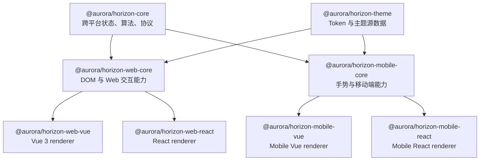

# Horizon 多平台组件库整改指南

## 1. 文档目的

本指南用于指导 Horizon 从当前以 Vue 3 为中心的 Web 组件库，渐进演进为同时支持 Vue 3、React，并能够继续扩展移动端实现的多平台组件体系。

整改的核心不是复制两套组件，也不是让 Vue 与 React 共享同一份 JSX，而是建立清晰、可测试的能力边界：

- 共享数据结构、状态机、算法、协议、设计 Token 和样式契约；
- Vue、React 分别使用各自原生的组件模型、生命周期和渲染能力；
- Web 与 Mobile 只共享真正与平台无关的能力；
- 保持现有 Vue 用户的 API 和升级路径稳定；
- 每次迁移都能够独立发布、验证和回滚，避免一次性重写。

## 2. 当前基线

当前仓库具有以下特点：

- `packages/horizon-web` 是 Vue 3 组件包，公开入口、安装器、组件类型和构建流程均直接依赖 Vue；
- 组件源码中大量使用 `ref`、`computed`、`watch`、`provide/inject`、VNode、Teleport 和 Vue Router；
- `@aurora/utils` 同时包含纯 TypeScript 工具与 Vue 专属组件、类型及 composable，当前不能直接作为 React 的公共依赖；
- `@aurora/icon` 是 Vue 图标组件包，需要抽离图标数据后才能提供 React renderer；
- `@aurora/locale`、`@aurora/locale-vue`、`@aurora/locale-react` 已经形成“公共内核 + 框架适配器”的有效先例；
- `@aurora/upload-adapters` 已经承载框架无关的上传协议与厂商适配，也是后续拆分复杂能力的参考实现；
- 当前 API Generator 主要从 Vue `defineComponent` 和 props/emits/slots/exposes 定义中读取元数据，需要演进为框架无关的元数据入口。

本轮整改应承认现有实现是成熟 Vue 组件库，而不是把它视为可以机械转换的通用组件源码。

## 3. 命名规范

Horizon 主组件包统一采用“产品名 + 平台 + 框架”的顺序：

```text
@aurora/horizon-core
@aurora/horizon-theme

@aurora/horizon-web-core
@aurora/horizon-web-vue
@aurora/horizon-web-react

@aurora/horizon-mobile-core
@aurora/horizon-mobile-vue
@aurora/horizon-mobile-react
```

其中：

- `core` 表示不直接渲染 UI 的公共能力；
- `web`、`mobile` 表示运行平台；
- `vue`、`react` 表示最终 renderer；
- 支撑型包可以继续使用 `locale-*`、`icon-*`、`upload-adapters` 等领域名称，不强制套用 Horizon 主包命名规则。

### 3.1 现有包改名与兼容

最终目标是：

```text
packages/horizon-web-vue     -> @aurora/horizon-web-vue
packages/horizon-web-react   -> @aurora/horizon-web-react
```

因为现有 `@aurora/horizon-web` 可能已经被业务项目使用，所以不能在同一版本中直接删除。建议保留一个兼容包：

```text
packages/horizon-web         -> @aurora/horizon-web
                              重新导出 @aurora/horizon-web-vue
                              并在文档和发布信息中标记 deprecated
```

兼容期至少覆盖一个完整的大版本周期。兼容包应满足：

- 默认导出、具名导出和样式入口与当前版本一致；
- 不复制 Vue 实现，只进行转发；
- 开发环境给出一次明确的迁移提示，生产环境不打印；
- 提供 codemod 或可审查的批量替换脚本；
- 文档中的新示例全部使用 `@aurora/horizon-web-vue`；
- `@aurora/horizon-web` 与 `@aurora/horizon-web-vue` 的版本保持同步，直到兼容包正式移除。

## 4. 目标架构



### 4.1 `@aurora/horizon-core`

只能包含与渲染框架、浏览器 DOM、移动端运行时无关的能力：

- 公共数据结构和领域类型；
- 组件状态机、reducer、controller 和事件协议；
- controlled/uncontrolled 状态计算规则；
- Select 值比较、Tree 数据变换、Table 排序过滤、日期区间计算等算法；
- 表单校验协议、异步请求状态、竞态与取消规则；
- 上传调度、重试、分片状态等纯业务逻辑；
- 无障碍语义状态，例如 active、selected、expanded 和 disabled，但不直接操作 DOM；
- 框架无关的组件 manifest 与 API 描述。

禁止导入：

- `vue`、`react`、`@vueuse/*`；
- VNode、ReactNode、JSX 类型；
- `window`、`document`、HTMLElement；
- Vue Router、React Router；
- Teleport、Portal、框架 Context。

### 4.2 `@aurora/horizon-theme`

负责统一设计语言，不负责组件运行时：

- Design Token 的 TypeScript、JSON 和 SCSS 源数据；
- 色彩、字号、字重、间距、圆角、阴影、层级和动效参数；
- Web CSS Variables 和组件 SCSS；
- Mobile renderer 可消费的 Token 输出；
- BEM 类名和 namespace 规则；
- 主题生成、覆盖和类型定义。

该包不得依赖 Vue 或 React。Web Vue 和 Web React 应尽量复用同一份 CSS，并以稳定 DOM/class 契约保证样式一致。

### 4.3 `@aurora/horizon-web-core`

负责可以被 Vue 和 React 共同使用、但依赖浏览器环境的能力：

- 浮层位置计算和碰撞检测；
- Focus Trap、焦点恢复和 roving tabindex；
- 点击外部、Escape 关闭和 dismissable layer；
- 滚动锁定、滚动定位、ResizeObserver 和 IntersectionObserver；
- 键盘导航意图解析；
- 虚拟滚动的测量与可视区计算；
- DOM 事件归一化；
- SSR 安全的浏览器能力封装。

该包可以依赖 `@floating-ui/dom` 等 DOM 级库，但不能依赖 `@floating-ui/vue` 或 React 专属包。所有浏览器对象都必须在调用阶段访问，禁止在模块初始化阶段直接读取 `window` 或 `document`。

### 4.4 `@aurora/horizon-web-vue`

由当前 `packages/horizon-web` 演进而来，负责：

- `defineComponent`、Vue JSX、props/emits/slots/exposes；
- `ref`、`computed`、`watch`、生命周期和 effect cleanup；
- `provide/inject`、Teleport、Transition；
- Vue Router 和 Vue 应用安装器；
- 将 Horizon controller 的 snapshot 转换为 Vue 响应式状态；
- 保持现有 Vue 组件 API 和行为兼容。

Vue 组件文件应主要负责渲染、布局、公开 API 接线和组合能力，复杂状态及算法逐步下沉到 core。

### 4.5 `@aurora/horizon-web-react`

负责：

- React JSX、Hooks、Context、Portal 和 Transition 集成；
- controlled/uncontrolled props 适配；
- 使用 `useSyncExternalStore` 订阅共享 controller；
- 使用 `forwardRef`、`useImperativeHandle` 暴露实例能力；
- React Router 等可选集成；
- React StrictMode 下幂等的订阅、副作用和清理；
- React 组件测试、文档示例和按需导入。

React 包不能导入 `@aurora/horizon-web-vue` 或通过挂载 Vue 组件实现功能。

### 4.6 Mobile 扩展边界

未来的 `horizon-mobile-core` 只复用真正跨平台的 `horizon-core` 和主题源数据，单独承载：

- 触摸与手势状态；
- Safe Area、软键盘和移动端视口；
- 长按、滑动、拖拽等移动端交互协议；
- 移动端导航和弹层语义；
- 平台性能约束和资源加载策略。

Web DOM 能力不得反向进入 Mobile 包。若 `horizon-mobile-react` 面向 React Native，应单独提供 Native renderer，不能假设存在 DOM 或 CSS。

## 5. 强制依赖方向

```text
horizon-core
    ↑
horizon-web-core
    ↑             ↑
horizon-web-vue   horizon-web-react
```

必须遵循：

1. renderer 可以依赖平台 core 和公共 core；
2. 平台 core 可以依赖公共 core；
3. core 永远不能反向依赖 renderer；
4. Vue 与 React renderer 不能相互依赖；
5. 组件之间优先通过公开契约协作，避免跨目录引用另一个组件的私有实现；
6. `horizon-theme` 不依赖任何运行时 renderer；
7. 框架专属依赖只能出现在对应 renderer 包中。

建议在 ESLint 和 CI 中添加依赖边界检查，并提供一个简单的源码扫描任务，阻止 core 中出现以下导入：

```text
vue
react
@vueuse/*
@floating-ui/vue
vue-router
react-router*
```

## 6. 能力拆分原则

### 6.1 应当共享

- Props 中与视图无关的数据类型、枚举和默认值；
- 状态转换、值归一化和事件原因；
- 异步任务、取消、重试、防重复提交和过期结果处理；
- Tree、Select、Table、DatePicker、Upload 等领域算法；
- 键盘操作所表达的行为意图；
- ARIA 所需的语义状态；
- CSS Variables、样式文件、组件 class 名称；
- locale key 和默认文案；
- 同一行为的测试向量和契约用例。

### 6.2 不应当共享

- Vue VNode 与 ReactNode；
- Vue composable 与 React Hook；
- `provide/inject` 与 React Context；
- Vue slot 与 React render props；
- Teleport 与 Portal；
- Vue/React 的组件实例类型；
- 框架 router 的具体类型；
- 框架专属的动画和生命周期实现；
- 为了共享渲染而设计的自定义 VDOM 或模板 DSL。

### 6.3 不以共享率作为唯一目标

建议目标：

- Token、CSS、类型和算法：70% 至 100% 共享；
- 交互状态及异步流程：50% 至 80% 共享；
- JSX、组件生命周期和框架集成：分别实现；
- 整体源码共享率达到约 40% 至 60% 即具备较高收益。

不得为了提高共享率而牺牲框架原生体验、类型质量、可调试性或无障碍能力。

## 7. Core 设计模式

简单、确定性的逻辑优先使用纯函数或 reducer：

```ts
export function reduceSelectState<T>(
  state: SelectState<T>,
  action: SelectAction<T>,
): SelectState<T> {
  // 只计算下一状态，不读取框架和 DOM
}
```

复杂交互、订阅和异步流程使用 controller：

```ts
export interface SelectController<T> {
  getSnapshot(): SelectSnapshot<T>;
  subscribe(listener: () => void): () => void;
  dispatch(action: SelectAction<T>): void;
  updateOptions(options: SelectOptions<T>): void;
  destroy(): void;
}
```

Controller 必须满足：

- snapshot 可预测且只包含可公开消费的数据；
- action 能明确描述用户意图和状态来源；
- effect 有清晰的启动、取消和销毁路径；
- 不保存 VNode、ReactNode 或框架组件实例；
- controlled props 更新时不会产生回写循环；
- 支持多个组件实例，不依赖不受控的全局单例；
- 可使用普通 Vitest 独立测试。

Vue renderer 将 snapshot 包装为 Vue 响应式状态；React renderer 使用 `useSyncExternalStore` 或等价机制订阅，二者共享相同的 reducer、controller 和行为测试向量。

## 8. Vue 与 React API 映射

不要求两套 API 字面完全相同，但必须保持语义和事件 payload 一致。

| 语义 | Vue 3 | React |
| --- | --- | --- |
| 受控值 | `modelValue` | `value` |
| 非受控初始值 | 现有 default/initial 规则 | `defaultValue` |
| 值更新 | `update:modelValue` | `onChange` |
| 打开状态 | `visible` 或现有对应字段 | `open` |
| 打开状态更新 | 对应 emit | `onOpenChange` |
| 内容定制 | slots | `children` / render props |
| 实例能力 | exposes | `ref` + imperative handle |
| 全局配置 | provide/inject | Provider/Context |
| DOM 引用 | Vue template/component ref | React ref |

### 8.1 共享语义类型

Core 应定义：

```text
SelectValue
SelectOptionData
SelectState
SelectAction
SelectChangeReason
SelectControllerOptions
```

Renderer 再定义：

```text
VueSelectProps / VueSelectSlots / VueSelectExposes
ReactSelectProps / ReactSelectRenderers / ReactSelectRef
```

### 8.2 路由适配

Core 不应依赖 Vue Router 或 React Router，使用能力接口：

```ts
export interface NavigationAdapter {
  push(to: unknown): void | Promise<void>;
  replace(to: unknown): void | Promise<void>;
}
```

Vue 和 React 通过各自 Provider 提供适配器。没有适配器时，普通 `href` 仍应可用，router 专属能力应给出明确、可测试的降级行为。

### 8.3 图标和渲染内容

共享层可以接受稳定的图标名称、数据描述或语义标识，但不能接受 Vue Component、VNode 或 ReactNode。建议逐步形成：

```text
@aurora/icon-core
@aurora/icon-vue
@aurora/icon-react
```

现有 `@aurora/icon` 可以在兼容期继续指向 Vue 实现。

## 9. 样式与 DOM 契约

Web Vue 和 Web React 应尽量使用同一份组件样式。为此必须建立稳定的 DOM 与 class 契约：

- 两端使用相同的 namespace 和 BEM block/element/modifier；
- 交互状态统一使用相同的 `is-*`、`has-*` class；
- CSS 不依赖 Vue 自动生成属性或 React 私有结构；
- 两端的语义元素、role、aria 属性和 tab 顺序保持一致；
- 浮层容器和 Portal/Teleport 的挂载结构需要形成显式契约；
- DOM 差异确实不可避免时，使用局部 renderer 样式文件，不污染公共主题层。

每个已迁移组件至少应有一组 DOM/class 契约测试和浏览器视觉回归测试。

## 10. 国际化

延续现有三层结构：

```text
@aurora/locale
├── @aurora/locale-vue
└── @aurora/locale-react
```

组件 locale key、默认字典和格式化协议应位于公共层；Vue/React 只负责响应式订阅和 Provider 集成。

要求：

- 两套 renderer 使用同一组 locale key；
- 所有受支持语言同时增加和校验键值；
- 错误、状态和控制文案不得直接硬编码；
- locale 切换在 Vue 与 React 中都能触发最小必要更新；
- SSR 时语言实例不能跨请求泄漏。

## 11. API 元数据与文档

当前以 Vue 组件源码为主的 API 分析方式需要替换为“公共 manifest + renderer 扩展”。建议每个组件提供：

```text
component.manifest.ts           # 描述、公共语义、事件、可访问性要求
component.vue.manifest.ts       # Vue props/emits/slots/exposes 映射
component.react.manifest.ts     # React props/callbacks/renderers/ref 映射
```

API Generator 应从 manifest 生成：

- Vue 与 React 的 API 表格；
- 中文和英文描述；
- IDE 元数据和类型辅助文件；
- 组件索引与按需导入元数据；
- API 语义差异说明。

文档站建议按组件组织页面，在同一组件页面提供 Vue/React tab，避免维护两份完全独立且容易漂移的说明。示例源码可以分框架存在，但场景、交互和预期结果应保持一致。

## 12. 迁移阶段

### 阶段 0：冻结规则与建立基线

交付物：

- 确认包命名、依赖方向和兼容周期；
- 建立架构决策记录；
- 记录当前组件清单、包依赖、测试和 bundle 基线；
- 在 CI 中加入 core 禁止框架依赖的检查；
- 明确 Vue 公开 API 不主动破坏的原则；
- 为迁移组件建立统一 Definition of Done。

退出条件：团队对包名、边界、兼容策略和首批组件达成一致。

### 阶段 1：创建基础包

交付物：

- 新建 `horizon-core`、`horizon-theme`、`horizon-web-core`、`horizon-web-react`；
- 将纯 class、namespace、类型判断和无框架工具从 `@aurora/utils` 中分离；
- 建立 Vue/React 独立构建、类型检查和测试任务；
- 建立统一 CSS 输出和 package exports；
- 形成 SSR、tree-shaking 和 sideEffects 规则；
- 建立最小 React 文档运行环境。

退出条件：空 renderer 包能够构建发布，core 产物不存在 Vue/React 依赖。

### 阶段 2：垂直试点

建议选择四类代表组件：

1. `Button`：基础 props、slot/render prop、异步状态和导航适配；
2. `Switch`：controlled/uncontrolled、键盘与 Form；
3. `Tooltip`：Portal/Teleport、定位、focus 和 dismiss；
4. `Select` 单选模式：复杂状态、Option、键盘导航、浮层和表单集成。

选择复杂度不同的组件，是为了尽早验证抽象能否覆盖真实组件，而不是只在静态展示组件上得到虚假的高共享率。

退出条件：

- 四个组件在 Vue 和 React 中完成公开 API、文档、测试和样式；
- Vue 现有行为无回退；
- 同一套核心 test vectors 在两端通过；
- DOM、ARIA、键盘流程和视觉结果达到约定；
- 团队确认 controller、DOM primitive 和 manifest 方案可以继续复用。

### 阶段 3：基础组件迁移

第一批展示与布局组件：

```text
Badge Avatar Card Divider Space Typography Progress Skeleton
```

第二批表单与状态组件：

```text
Input Checkbox Radio Segmented Slider Tabs Collapse Pagination
```

第三批浮层组件应在统一 overlay primitives 之上迁移：

```text
Tooltip Popover Dropdown Popconfirm Dialog Drawer
```

退出条件：React 已具备可用于普通业务页面的基础组件集合，公共主题、Form 和 overlay 基础设施稳定。

### 阶段 4：复杂组件族迁移

按基础依赖顺序推进：

```text
Picker
  -> Select / AutoComplete / Cascader / TreeSelect

Input + Form
  -> InputNumber / DatePicker / TimePicker

VirtualScroller
  -> Select / Tree / Table

Overlay
  -> Dialog / Drawer / Guide / ColorPicker

Upload Core
  -> Web Vue Upload / Web React Upload
```

Tree、Table、Upload 等组件应优先抽出数据模型、算法和异步调度，再实现 React renderer，不允许直接复制整个 Vue 目录后长期双维护。

### 阶段 5：包改名与兼容发布

交付物：

- 将现有实现迁移到 `packages/horizon-web-vue`；
- 发布 `@aurora/horizon-web-vue`；
- 将 `@aurora/horizon-web` 改为兼容转发包；
- 更新文档、模板、resolver、API Generator 和内部依赖；
- 提供业务项目迁移说明和 codemod；
- 监控兼容包使用量和迁移问题；
- 在预告的大版本中移除兼容包。

## 13. 组件迁移模板

每个组件按以下顺序处理：

1. 记录当前 Vue props、emits、slots、exposes、DOM、class、ARIA 和边界状态；
2. 标记纯逻辑、DOM 逻辑、Vue 生命周期和渲染逻辑；
3. 将纯类型、默认值、算法和状态机移动到 `horizon-core`；
4. 将通用 DOM 行为移动到 `horizon-web-core`；
5. 让现有 Vue 组件重新消费拆出的能力，并运行原测试；
6. 实现 React adapter 和 React 原生 API；
7. 共享主题样式并补充 DOM/class 契约测试；
8. 补齐中文、英文文档和两端示例；
9. 运行 core、Vue、React、browser、SSR 和类型检查；
10. 独立提交该组件迁移，避免混入不相关重构。

## 14. 测试矩阵

### 14.1 Core 测试

- reducer、controller、算法和类型守卫；
- controlled/uncontrolled 状态转换；
- 异步取消、竞态、重试和重复事件；
- disabled、read-only、loading、empty、error 等状态；
- 键盘行为意图和无障碍状态；
- 多实例隔离和销毁。

### 14.2 Renderer 测试

Vue 使用 Vue Test Utils，React 使用 React Testing Library，分别验证：

- 公开 props/callbacks/slots/render props/ref；
- Form、locale、theme、router 等 Provider 集成；
- 生命周期清理和受控值同步；
- React StrictMode 与 Vue scope disposal；
- Portal/Teleport、焦点恢复和滚动锁定；
- 框架专属边界和错误提示。

### 14.3 契约与浏览器测试

- DOM 结构和 class 快照；
- ARIA role、name、state 和 tab 顺序；
- 指针、键盘和触摸路径；
- light/dark theme；
- 390px 窄视口、长文本、缩放和 RTL；
- Vue 与 React 的关键场景截图对比；
- SSR render、hydrate 和无浏览器环境 import；
- bundle tree-shaking 和按需引入。

## 15. 发布与版本策略

- Core、platform core 和 renderer 的版本应由统一 release plan 管理；
- 公共契约的 breaking change 必须同时评估所有 renderer；
- renderer 专属 API 可以独立增加，但不能悄悄改变公共语义；
- 兼容包与 Vue renderer 在兼容期保持同版本；
- package exports 明确区分主入口、样式入口、主题入口和可选集成；
- peerDependencies 只声明 renderer 必需的框架运行时；
- 所有包明确配置 `sideEffects`，CSS 入口不能被错误 tree-shake；
- 发布前验证 ESM、CJS（如继续支持）、类型声明和 SSR 使用场景。

## 16. 禁止做法

- 在 React 组件中挂载 Vue 组件；
- 将 Vue TSX 通过字符串替换或 AST 转换长期作为 React 源码；
- 创建一套自定义 VDOM/模板 DSL 来统一 Vue 和 React 渲染；
- 把 VNode、ReactNode 或框架实例放入公共 Core；
- 让 `horizon-core` 在模块初始化时访问 DOM；
- 复制复杂组件后让 Vue/React 两套算法独立演进；
- 为了 DOM 完全相同而破坏框架原生语义；
- 在没有契约测试的情况下共享复杂 CSS；
- 一次性迁移全部组件或一次性改掉所有公开包名。

## 17. 主要风险与控制措施

| 风险 | 控制措施 |
| --- | --- |
| 抽象过度，Core 成为另一套框架 | Core 只承载状态、算法和协议；渲染分别实现 |
| Vue 行为回退 | 先让 Vue 消费抽出的 Core，再实现 React；保留原测试 |
| 两端 API 漂移 | 公共 manifest、共享 test vectors、语义映射表 |
| CSS 共享导致 DOM 结构僵化 | 维护稳定语义/class 契约，允许小范围 renderer 样式 |
| 浮层、焦点和 SSR 问题 | 统一 Web primitives，增加浏览器及 SSR 契约测试 |
| 包数量过多 | 只发布稳定边界；早期可先以 workspace 内部包验证 |
| 业务迁移成本高 | 兼容包、codemod、迁移文档和完整大版本周期 |
| React 实现长期落后 | 组件 Definition of Done 要求 Vue/React/API/文档同步 |

## 18. Definition of Done

一个组件只有同时满足以下条件，才算完成多框架迁移：

- 公共类型、状态、算法和平台能力已放在正确层级；
- Core 不含 Vue/React/DOM 非法依赖；
- Vue 公开 API 和已有行为保持兼容；
- React 使用原生 React API，不暴露 Vue 概念；
- Vue/React 使用相同的 Token、locale key 和行为 test vectors；
- pointer、keyboard、focus、disabled、loading、empty、error 等状态完整；
- controlled props、内部状态、事件和实例方法保持同步；
- 两端均有类型测试、单元测试和必要的浏览器测试；
- 中文、英文文档、API 表和示例完整；
- 支持 SSR、按需引入和 tree-shaking；
- 变更已经过格式、lint、类型、测试和构建验证；
- 组件迁移提交不包含无关改动。

## 19. 首个执行里程碑

第一里程碑不以“完成多少 React 组件”为目标，而以验证架构闭环为目标：

1. 建立 `horizon-core`、`horizon-theme`、`horizon-web-core`、`horizon-web-react` 骨架；
2. 分离当前 `@aurora/utils` 中的纯工具与 Vue 工具；
3. 完成 Button、Switch、Tooltip、Select 单选模式四个垂直试点；
4. 打通 Vue/React 构建、测试、文档、主题和 API Generator；
5. 形成可复制的组件迁移模板；
6. 通过评审后再批量迁移基础组件。

这一里程碑完成后，再根据试点中的实际共享比例、bundle 变化、API 差异和维护成本，确认后续复杂组件的排期与人员投入。
